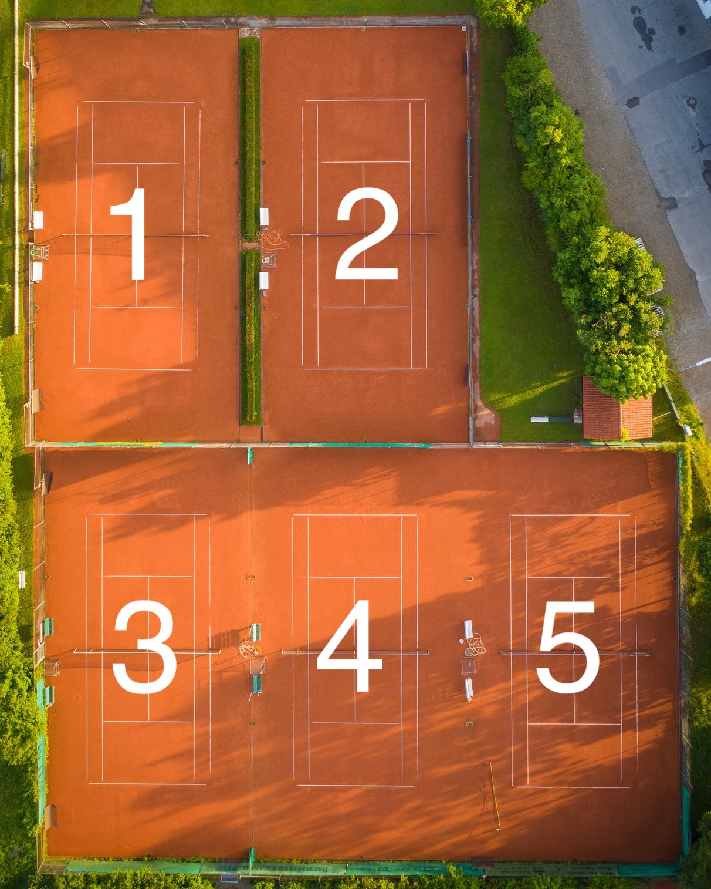
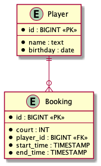

## Introduction To SQL Databases With Java
2021-06-22

- Relational Databases
- Postgres Installation
- SQL
- Java and SQL
- Spring Data

---
## About Me
- Ansgar Hugo
- Solution Architect and Fullstack Developer since 20 years
- contact@ansgarhugo.de

---
## Relational Databases
- RDBMS: Relational database management system
- SQL: Structured Query Language
  https://en.wikipedia.org/wiki/Relational_database
---
## Popular Vendors - SQL Is Leading

https://db-engines.com/en/ranking

---
## Sample Project - Tennis Court Booking
 player <peter> books court <1> on <Fri 14:00>

---
## Relations / Tables / Entities

| SQL term           | Relational term          | Example                                             |
| :-------------     | :-------------           | :-----                                              |
| Table              | Relation or Base relvar  | Player, Booking                                     |
| Row                | Tuple or record          | Booking "Fred, Friday, 14:00, Court 1               |
| Column             | Attribute or field       | Player: id, name, birthday                          |
| View or result set | Derived relation         | All bookings for court 2 on friday                  |

---
## Entity Relationship Diagram

---
## Relationship Concepts and Terms
- Primary key
- Foreign key
- Many to one: Children -> Mother
- Many to many: Student <-> Teacher
- One to many: Mother -> Children

Question: What relationship has "parents - children"?

---

## ACID

ACID is a feature of database transactions intended to guarantee data validity.

- Atomicity: Transaction is a single unit
- Consistency: Data wont get corrupt by your transaction
- Isolation: Concurrent transactions do not influence each other
  - here it gets more complicated as conflicts are possible and strategies exist (concurrency control mechanisms) to
    mitigate them
- Durability: Survive power outage

