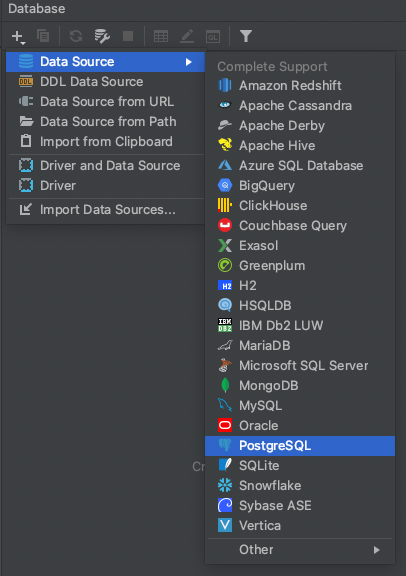
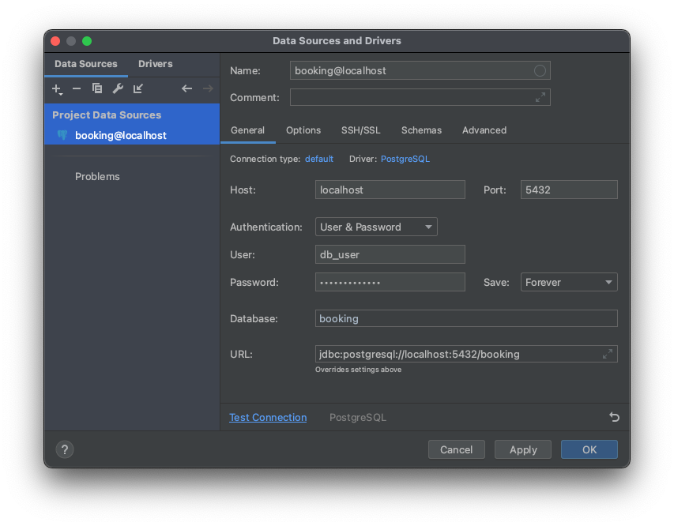
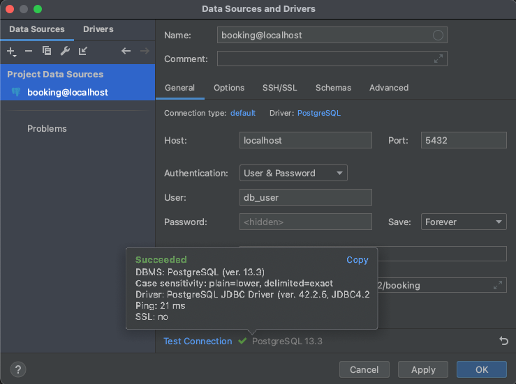
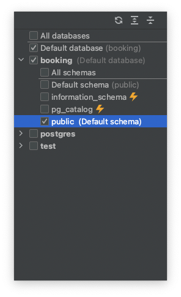
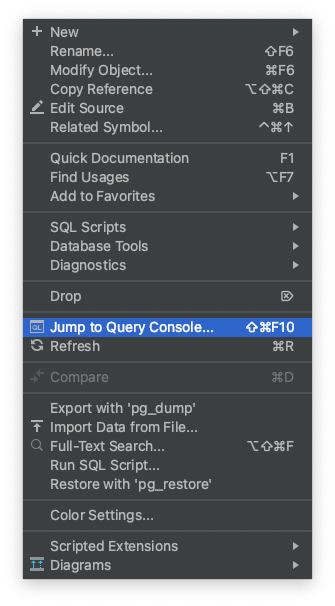

# SQL - Structured Query Language
- ANSI Standard since SQL-86, but many dialects and proprietary per vendor
- SQL-86, SQL-89, SQL-92,... SQL:2016
- Don't panik, the Standard covers 99% of use cases


- DDL: Data definition language (CREATE, DROP, ALTER, TRUNCATE)
- DQL: Data query language (SELECT)
- DML: Data manipulation language (INSERT, UPDATE)
- DCL: Data control language (GRANT, REVOKE)

---

---
# DB Tool - Intellij Idea - Add datasource


---
# DB Tool - Intellij Idea - Configure connection
Download drive in Intellij if not yet downloaded. For other tools you can
get the driver [here](https://jdbc.postgresql.org).



---
# DB Tool - Intellij Idea - Test connection


---
# DB Tool - Intellij Idea - Select schema


---
# DB Tool - Intellij Idea - Open console


---
# Create table
```sql
CREATE TABLE player
(
  id       BIGINT GENERATED BY DEFAULT AS IDENTITY PRIMARY KEY,
  name     TEXT NOT NULL,
  birthday DATE NOT NULL
);
```

---
# Create table with reference
```sql
CREATE TABLE booking
(
  id         BIGINT GENERATED BY DEFAULT AS IDENTITY PRIMARY KEY,
  court      INT       NOT NULL,
  player_id  BIGSERIAL NOT NULL REFERENCES player (id),
  start_time TIMESTAMP WITH TIME ZONE,
  end_time   TIMESTAMP WITH TIME ZONE
);
```

---
# Constraints - Some examples
```sql
-- Alternative way of adding constraints later:
ALTER TABLE booking ADD FOREIGN KEY ("player_id") REFERENCES player ("id");

-- prevent duplicates
CREATE UNIQUE INDEX player_name_uidx ON player(name);

-- index used for search
CREATE INDEX player_birthday_idx ON player(birthday);
```
---
# PostgreSQL data types
[Postgres Data Types](https://www.postgresql.org/docs/current/datatype.html)

---
# Insert new data

```sql
INSERT INTO player (id, name, birthday)
VALUES (DEFAULT, 'Sandra', '2002-04-01');

INSERT INTO player (name, birthday)
VALUES ('Peter', '2005-05-01');
```

---
# Bulk insert
```sql
INSERT INTO player (name, birthday)
VALUES ('Leon', '1990-12-01'),
       ('Paul', '1993-06-01'),
       ('Ben', '2004-09-01'),
       ('Finn', '1988-08-01'),
       ('Felix', '2001-06-01'),
       ('Lina', '2003-03-01'),
       ('Lea', '1996-11-01'),
       ('Clara', '1989-12-01'),
       ('Hanna', '2000-01-01');
```

---
# Query data
```sql
-- select all players born after year 2000
SELECT *
FROM player
WHERE birthday >= '2000-01-01';
```
```sql
-- Select all adults
SELECT *
FROM player
WHERE birthday < NOW() - INTERVAL '18 years';
```
---
# More queries
```sql
SELECT *
FROM player
WHERE birthday < NOW() - INTERVAL '18 years'
AND name ilike 'l%';
```
---
# Update existing data
```sql
UPDATE player
SET birthday = '2005-02-15'
WHERE name = 'Peter';
```
Exercise:
- Add other Peter (yes, same name) with different birthday
- Update Peters birthday to 1st of November 1999
- What's the result?

---
# Delete existing data
```sql
UPDATE player
SET birthday = '2005-02-15'
WHERE name = 'Peter';
```
Exercise:
- Add other Peter (yes, same name) with different birthday

