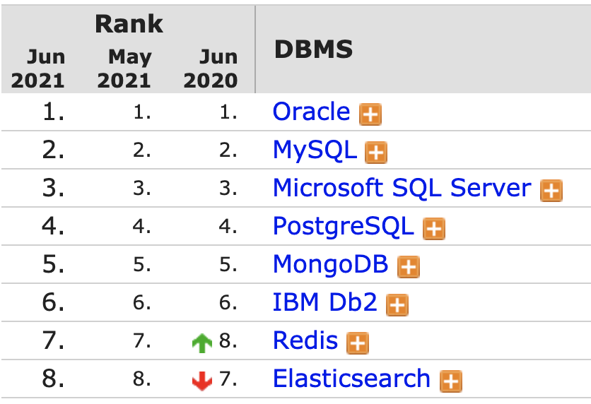

# Relational databases
- Relational database management system (RDBMS).

---
# Relations / Tables
| SQL term           | Relational database term | Example  |
| :-------------     | :-------------           | :-----       |
| Row                | Tuple or record          | A data set representing a single item |
| Column             | Attribute or field       | A labeled element of a tuple, e.g. "Zipcode" or "Date of birth" |
| Table              | Relation or Base relvar  | A set of tuples sharing the same attributes; a set of columns and rows |
| View or result set | Derived relvar           | Any set of tuples; a data report from the RDBMS in response to a query |

source: [Wikipedia: Relational_database][https://en.wikipedia.org/wiki/Relational_database]

---
## Relations
---

## ACID

ACID is a feature of database transactions intended to guarantee data validity.

- Atomicity: Transaction is a single unit
- Consistency: Data wont get corrupt by your transaction
- Isolation: Concurrent transactions do not influence each other
  - here it gets more complicated as conflicts are possible and strategies exist (concurrency control mechanisms) to
    mitigate them
- Durability: Survive power outage

---

# Popular vendors

https://db-engines.com/en/ranking

---
# SQL
Structured Query Language

---
# Flyway
---
# JPA, Hibernate
---
# Sring Data

---

# Integration testing

- Testcontainers
- Non-docker alternative: H2 in memory DB

Other popular testing frameworks can be found on [Libhunt][3], for example:

- [Rest assured][1]
- [Wiremock][2]
- Apache camel
- [Citrus framework](https://citrusframework.org)

---

# JPQL

[1]: https://rest-assured.io

[2]: http://wiremock.org

[3]: https://java.libhunt.com/categories/448-testing

[https://en.wikipedia.org/wiki/Relational_database]: https://en.wikipedia.org/wiki/Relational_database
